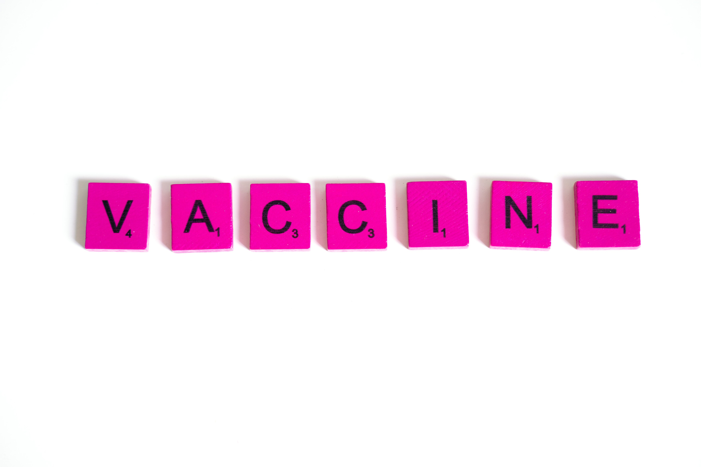
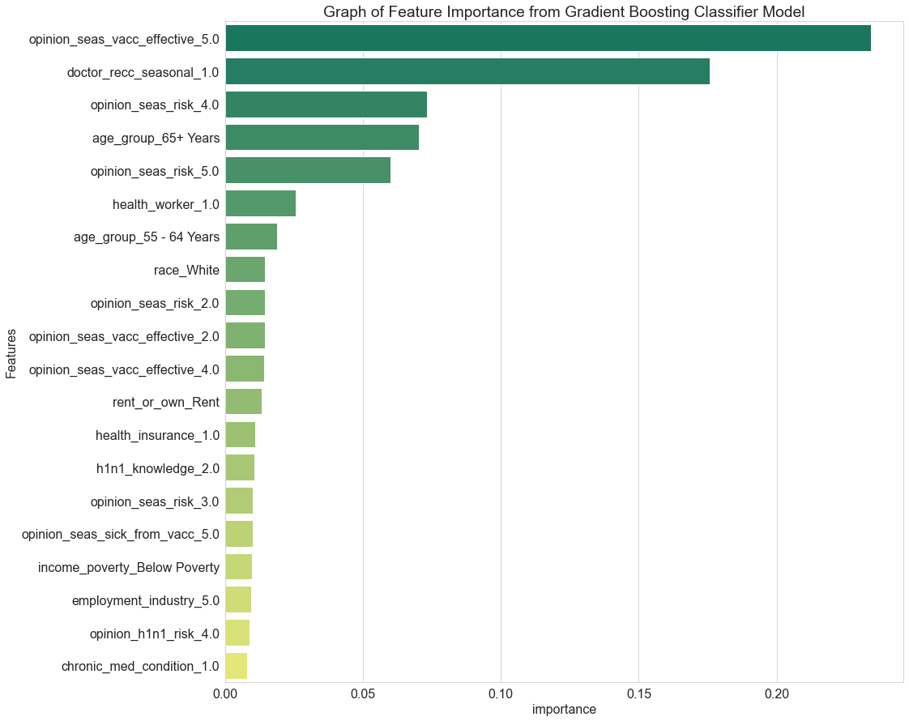

# Prediction of H1N1 and Seasonal Flu Vaccinations 

## Introduction

Influenza(flu) is an illness that causes respiratory problems and can lead to hospitalisation or even death in some cases as a result of its complications. People over the age of 65, young children and people with pre-existing conditions are at a higher risk of flu-related [complications](https://www.cdc.gov/flu/about/index.html). An annual seasonal flu vaccine can help mitigate the effects of the flu by reducing its severity. The vaccine causes antibodies to develop after two weeks which provide protection against the flu. Everyone over 6 months of age is advised to take the vaccine according to the [Center for Disease Control and Prevention](https://www.cdc.gov/flu/prevent/keyfacts.htm).

The H1N1 pandemic began in 2009 and the influenza A virus first emerged in the United States and led to the deaths of approximately 151700-575400 people worldwide. The flu primarily affected young children and middle aged adults but surprisingly, people over 60 years old were less affected, presumably because they had antibodies against this virus, likely from exposure to an older H1N1 virus earlier in their lives. A vaccine for the flu became available to the public in October 2009 and consequently, the World Health Organisation (WHO) declared an end to the pandemic in August 2010. However, the virus continues to circulate as a seasonal [flu virus](https://www.cdc.gov/flu/pandemic-resources/2009-h1n1-pandemic.html).

### Problem Statement
Vaccine hesitancy is the unwillingness to receive vaccines due to fears of the vaccine's effects on one's body and is one of the biggest threats to global health. People's views on vaccination are influenced by the personal and social circumstances and they can change over time. Unfortunately, the effects of vaccine hesitancy are more pronounced during pandemics and pose huge risks to the wider community as denoted in this paper by [Wiysonge CS, Ndwandwe D. et al.](https://pubmed.ncbi.nlm.nih.gov/33684019/).

### Main Objective

The goal of this project is to create a model that can predict seasonal flu vaccine uptake based on a person's background and behavioral patterns.

## Data Description
The datasets used for this project were downloaded from [Driven Data]("https://www.drivendata.org/competitions/66/flu-shot-learning/page/210/). The original data source is the [National 2009 H1N1 Flu Survey (NHFS)](https://webarchive.loc.gov/all/20140511165905/http://www.cdc.gov/nchs/nis/data_files_h1n1.htm) and it contains information on the social,economic and demographic backgrounds of the respondents as well as their opinions on the H1N1 and seasonal flu vaccines. The datasets have been divided into the training set features and the training set labels. The training data has 26707 rows and 36 columns.

## Data Preparation
The data was loaded and assessed after which some EDA was performed for better understanding. There were a lot of missing values, which were replaced and some of the rows were dropped. All of the features are categorical in nature therefore their datatypes were changed in order to perform one hot encoding as that the data coulld be fit for modeling. 

## Modeling
The data was split into the training and test datasets with the training data used to fit the models and the test data used to evaluate them. The baseline model was created using Logistic Regression after which Recursive Feature Elimination (RFE) was employed so as to remove features that were not helpful for model performance. RandomForest as well as gradient boosting models such as XGBClassifier and GradientBoostingClassifier were used.

## Evaluation
The best model is the one from the GradientBoostingClassifier with an accuracy of 78.98% and a training accuracy of 81.36%. Cross validation has also been undertaken 10 times to return a mean accuracy of 78.95%. This means that the model is able to correctly classify 78.98% observations.

Some of the features that are most crucial in predicting the uptake of seasonal flu vaccine are:
* The respondent's opinion on the effectiveness of the vaccine - if a person thinks the vaccine is very effective, they are very likely to take it
* Doctor's recommendation to take the vaccine
* The respondent's opinion on the risks involved with not being vaccinated - if a person thinks they are at high risk of getting sick they're more likely to take the vaccine
* People older than 65

These feature importances have also dominated all the tested models and are shown below:

## Recommendations

From the models it can be concluded that people's opinions have a huge impact on their likelihood to take vaccines. In light of this, the following recommendations can be made:-

* Public awareness campaigns should be made regarding the effectiveness of the seasonal flu vaccine as well as the risks associated with the flu.
* It would help to emphasise the safety of the vaccines for use by the public.
* Older people are more likely to take the seasonal flu vaccine. The younger population could, therefore, be targeted for such campaigns. 

## Repository Guide

The datasets used can be found [here](Dataset)

The notebook can be found [here](analysis.ipynb)

The presentation can be found [here](<Seasonal Flu Prediction.pdf>)

The data report can be found [here](Prediction_of_H1N1_and_Seasonal_Flu_Vaccinations_Data_Report.pdf)